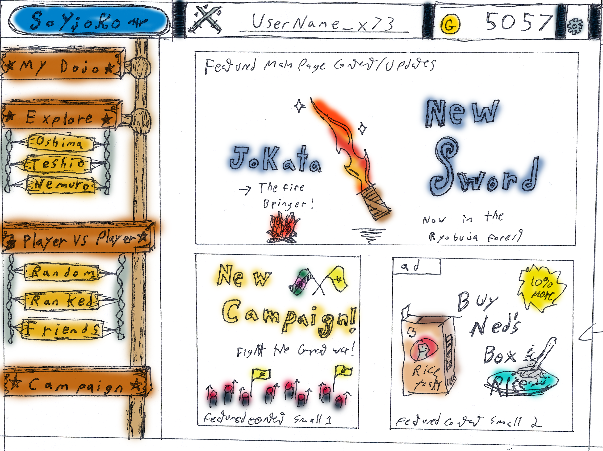
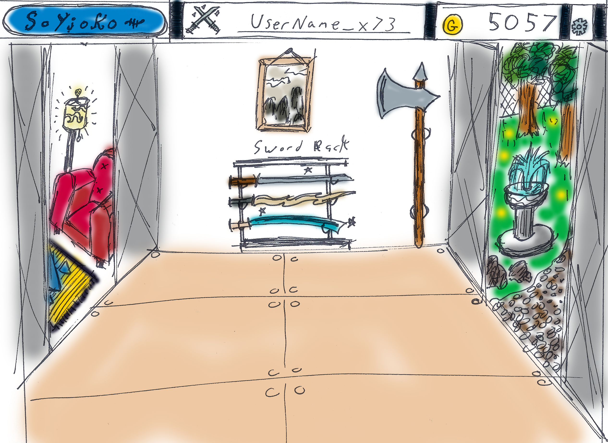

#SoYjoko 
##A web based samurai adventure game

##Overview

####Soyjoko is an HTML game with javascript and java elements reminiscent of online games such as Adventure Quest and Neopets.

####Soyjoko is primarily single player focused and revolved around the user playing as a samurai in feudal Japan. The user can navigate the site as their customizable samurai character, exploring, training, fighting, and building a personal dojo.

####Soyjoko also has engaging multiplier elements such as training at and visiting other players houses and dojos. Player vs player combat is also a main aspect of the game. Players can fight against friends or random opponents. There is also a ranked mode where players players can test their skill and rank up to win prizes. 

####There will also be daily events such as fighting in the campaign, or taking part is certain minigames which can only be done once a day, this will keep users interested and coming back.

####Here we have a mockup of the main page of the site. 

####Easy access bar at top is present on every page

* Logo at top left links back to main page
* Clicking on username at top center links to user profile
* Clicking on gold at top center right links to user's dojo/house
* Clicking the cog at the top left links to account settings page

####Main page specific items include:

####Easy navigation to main website features on the left side of the screen
* `My Dojo` links to player's personal dojo/house
* `Explore` goes to the world map. This menu includes sublinks to major town areas
* `Player vs Player` goes to the pvp main screen. This menu includes sublinks to major pvp features.
* `Campaign` goes to a singleplayer campaign page, there is only ever one campaign open, and each is for a limited time. Players can fight in the campaign and work together as an online community to make progress and win prizes. 

####Featured content in the main window of the screen
* Rotating content informing players of announcements, updates, and new content.
* Space for external advertisers is included for site revenue.

####Here we have a mockup of a town area

####Town areas are interactive menus. Players can click around on different elements and discover new parts of the world. Although these interactive menus are less obvious than a traditional menus, they add to the sense of exploration, and are more rewarding to players in the long run.

####New areas will be added with updates and each area has different buildings and features. Some areas are not accessible immediately and must be found through exploration

####In this town we have:

* Casino Subarea with gambling minigames for players to earn gold
* Ramen shop where players can buy food to restore health and give bonuses in combat
* Blacksmith where players can purchase or learn to forge new weapons
* Path to forest area where players can fight rogue samurai, encounter random events, and discover new areas
* In each of these areas players will meet characters who may offer quests, hints, or interesting information
* Link back to the main world map of all towns.

####Here we have a mockup of the combat interface. This same interface is used for fighting during singleplayer exploration, campaigns, and player vs player combat. 

####Each samurai's username and health bar are displayed at the top of the screen above thier character. 

#### Combat is turn based and is played through the four colored buttons at the bottom left of the screen. 

#### Yellow
* The yellow button is the player's main attack
* Players can customize this button with any primary attack they have learned. 
* Different attacks have different strengths and weaknesses.
* Damage is based on both players stats such as armor type, weapon type, strength, agility, and attack type and also some randomness through random number generation.
* There is a chance that the attack will be a critical hit and will deal extra damage.

####Blue
* The blue button chooses the try to block or parry the opponents attack.
* When the opponent is attacking the player is given a visual cue that can be responded to before the attack registers next turn.
* Blocking allows to player to have a chance to take reduced damage.
* The downside of blocking is that the player may lose balance or poise, and can have his/her next turn limited.
* There is also a chance that a block will be a critical block or parry/riposte. If this happens, not only does the player take no damage, but he/she will land a critical hit on the opponent.

####Green
* The green button allows the player to doge an opponent's attack.
* Dodging has the upside of allowing the player a chance to take no damage, but also has the downside of not having a chance to perform a critical block.
* Dodging also has a chance that the player will lose balance.
* Dodging is also more effecting against large weapons

####Red
* The red button allows the player to use a special move. 
* Special moves can be customized and chosen from and move the player has learned.
* Special moves vary widely, but generally have a limited number of uses per fight.
* Some special moves deal extra damage, some cannot be blocked, some stun the opponent etc.
* The players choice of special move will have a great impact over their fighting strategy. 

####Users can also choose to run from a battle, but this is not the way of the samurai and will have dishonorable consequences. 

####Here we have a mockup of the players Dojo, House, and Garden

These three areas are totally customizable and can be navigated though interactive menu similar to explorable areas. Players can display their rare items, weapons, and trophies, and other players can come visit.

####Dojo
* This is the main area shown in this mockup
* includes sword rack and training mats, can be customized to include lots more additional furniture and training equipment. 
* Other players can pay in gold to take lessons at the dojo and learn moves and techniques which the player has learned and acquired.

####House
* There is a preview of the player's house on the left of this mockup.
* The player can fully customize their house with furniture and any owned items.

####Garden
* There is a preview of the player's garden on the right of the mockup.
* This garden can be customized and designed with sculptures or fixtures such as fountains and rock gardens.
* The player may also make a shrine in his/her garden.
* This shrine is based on Shintoism and the player can pray to individual Shinto gods (kami) to gain passive bonuses throughout play.

##Technical info

####System: 
Soyjoko is planned to be usable in all major web browsers and operating systems.

####Design Choices: 
Major design components such as navigation menu on the left side of the screen and links to important profile pages on the top of the screen, and the settings cog icon, have been lovingly adopted from many well known websites such as facebook, youtube, reddit etc.

Not included in the mockup is a `sign up` splash screen which new users will be greeted with. Most important gameplay features will be highlighted  upon sign up, and should be easy to learn and access through large obvious and well labeled links on the main page. Less obvious features such as subareas and minigames are purposefully less obvious as discovery is part of the fun of the game.

Combat options are obvious and are large and color coded. Users are not greeted with long menus during combat, and see only 4 color coded buttons. These can then be customized later once users get better and learn new abilities. Combat strategy will not be apparent at first, but this is part of the learning process, and basic combat info will be included in a mandatory tutorial for new accounts. 

This mockup does not include the interface for buying items and customizing user profile, and living spaces. These menus will be large and as clear as possible. They will simple but also descriptive, including additional information when items are moused over.

##Usability Metrics

####Learnability
Although there is a lot of various functionality in the site. Most major tasks should be obvious from the main page menu. It is not immediately obvious that clicking the username or gold at the top of the screen will go to user page and dojo. Also, navigating certain features may take some time to learn. However, there will be some basic tutorial information for the major site features upon account creation. Also, as I have stated, some features for exploration are intentionally not obvious and are part of the game.

####Efficiency 
Efficiency should be very good. The user can get to most pages on the site with one or two clicks. The logo at the top left will go to the main page which has lots of crucial links. Users should be able to very quickly get to where they want to go on the site. And continued updates will possible add links to the main navigation. Also, because the game is made in HTML, users can bookmark pages which they wish to access quickly. 

####Memorability
Along with efficiency memorability should be very good. Once a user learns how to perform an action, it will always be the same, and will always be accomplished by a small number of clicks. Everything is shown visually and so there are no difficult commands or keyboard shortcuts to remember. Future updates will never overwrite previous updates, so even if more content is added, old content will still be accessible in the same way.

####Satisfaction
Because this is a webgame, it is designed to be very satisfying. Users should enjoy the feelings of exploration, discovering new places, learning new techniques, leveling up, finding rare items, decorating their homes, and engaging in combat. If through user testing, any aspect of the site appears tedious and not fun or satisfying, then it will be changed to create a better user experience.

####Errors
Errors are possible if a page url changes and internal or external links become broken. Care will have to be made to avoid this when expanding the site. All user stats, items and gold, and most interaction will be stored serverside, so there is no possibility of a user losing his/her items, or additional gold or items being hacked in. Other errors will likely become apparent upon implementation, but with careful monitoring of user feedback and testers, serious errors can be avoided or promptly fixed.
